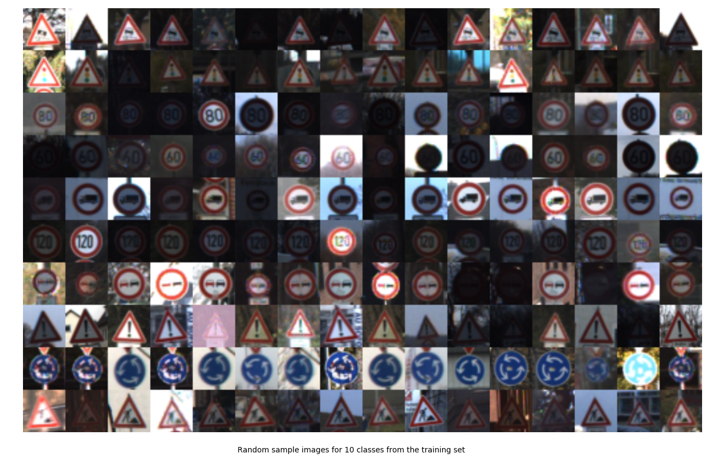
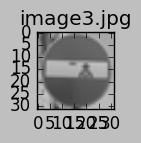
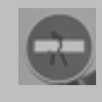

# Self-Driving Car Engineer Nanodegree

## Deep Learning

## Project: Build a Traffic Sign Recognition Classifier Write Up

This is a write up based on the Jupyter notebook that successfully implemented the project requirements in Python. 

>**Note:** I struggled with this project because of my relative inexperience with python. I received help from various websites for tips. An important aid used was the example at https://github.com/tdanyluk/CarND-Traffic-Sign-Classifier-Project.  I also used the example images from https://github.com/juano2310/CarND-Traffic-Sign-Classifier-Project-Juan with conversion.

---
## Step 0: Load The Data

    
```python
import numpy as np
import tensorflow as tf
import matplotlib.pyplot as plt
import random
import os.path
import warnings
#from tqdm import tqdm
import skimage.color
from skimage import exposure
import sklearn.utils
import matplotlib.image as mpimg
import numpy as np
import os
import cv2
import PIL
import csv

# Load pickled data
import pickle

training_file = 'train.p'
validation_file = 'valid.p'
testing_file = 'test.p'

with open(training_file, mode='rb') as f:
    train = pickle.load(f)
with open(validation_file, mode='rb') as f:
    valid = pickle.load(f)
with open(testing_file, mode='rb') as f:
    test = pickle.load(f)
    
X_train, y_train = train['features'], train['labels']
X_valid, y_valid = valid['features'], valid['labels']
X_test, y_test = test['features'], test['labels']

print("X_train shape:", X_train.shape)
print("y_train shape:", y_train.shape)
print("X_valid shape:", X_valid.shape)
#print("y_valid shape:", y_valid.shape)
print("X_test shape:", X_test.shape)
#print("y_test shape:", y_test.shape)
```

    X_train shape: (34799, 32, 32, 3)
    y_train shape: (34799,)
    X_valid shape: (4410, 32, 32, 3)
    X_test shape: (12630, 32, 32, 3)


---

## Step 1: Dataset Summary & Exploration

The pickled data is a dictionary with 4 key/value pairs:

- `'features'` is a 4D array containing raw pixel data of the traffic sign images, (num examples, width, height, channels).
- `'labels'` is a 1D array containing the label/class id of the traffic sign. The file `signnames.csv` contains id -> name mappings for each id.
- `'sizes'` is a list containing tuples, (width, height) representing the original width and height the image.
- `'coords'` is a list containing tuples, (x1, y1, x2, y2) representing coordinates of a bounding box around the sign in the image. **THESE COORDINATES ASSUME THE ORIGINAL IMAGE. THE PICKLED DATA CONTAINS RESIZED VERSIONS (32 by 32) OF THESE IMAGES**

Complete the basic data summary below. Use python, numpy and/or pandas methods to calculate the data summary rather than hard coding the results. For example, the [pandas shape method](http://pandas.pydata.org/pandas-docs/stable/generated/pandas.DataFrame.shape.html) might be useful for calculating some of the summary results. 

### Basic Summary of the Data Set Using Python, Numpy and/or Pandas


```python
### Replace each question mark with the appropriate value. 
### Use python, pandas or numpy methods rather than hard coding the results

# Number of training examples
n_train = X_train.shape[0]

# Number of validation examples
n_validation = X_valid.shape[0]

# Number of testing examples.
n_test = X_test.shape[0]

# What's the shape of an traffic sign image?
image_shape = X_train.shape[1:]

# How many unique classes/labels there are in the dataset.
n_classes = np.unique(np.concatenate((y_train, y_valid, y_test))).shape[0]

print("Number of training examples =", n_train)
print("Number of validation examples =", n_validation)
print("Number of testing examples =", n_test)
print("Image data shape =", image_shape)
print("Number of classes =", n_classes)
```

    Number of training examples = 34799
    Number of validation examples = 4410
    Number of testing examples = 12630
    Image data shape = (32, 32, 3)
    Number of classes = 43


### Exploratory visualization of the dataset

Visualize the German Traffic Signs Dataset using the pickled file(s). This is open ended, suggestions include: plotting traffic sign images, plotting the count of each sign, etc. 

Q: Is the distribution the same? 

**Doug**: The training set has around 200 examples for about a quarter of the images, while others have 10 times that number. 

Q: Are there more examples of some classes than others?

**Doug**: The fewest examples are for:
- 0,Speed limit (20km/h)
- 19,Dangerous curve to the left
- 37,Go straight or left

The most examples are for:
- 1,Speed limit (30km/h)
- 2,Speed limit (50km/h)
- 38,Keep right


```python
### Data exploration visualization code is here.
# Visualizations will be shown in the notebook.
def assort_indices_by_class(y):
    ret =  [[] for class_ in range(n_classes)] 
    for i in range(y.shape[0]):
        ret[y[i]].append(i)
    return ret

def show_demo_grid(X, y, title):
    classes_to_show = 10
    samples_to_show = 16
    
    is_gray = (len(X.shape) == 3)
    
    height = X.shape[1]
    width = X.shape[2]
    if not is_gray:
        depth = X.shape[3]

    indices_by_class = assort_indices_by_class(y)
            
    if is_gray:
        grid_shape = (classes_to_show * height, samples_to_show * width)
    else:
        grid_shape = (classes_to_show * height, samples_to_show * width, depth)
        
    grid = np.empty(grid_shape, dtype=X.dtype)
    
    row = 0
    for c in random.sample(range(n_classes), classes_to_show):
        col = 0
        for i in random.sample(indices_by_class[c], samples_to_show):
            grid[row * height : (row+1) * height, col * width : (col+1) * width] = X[i]
            col = col + 1
        row = row + 1
    
    dpi = 32
    fig = plt.figure(0, (grid_shape[1] / dpi, grid_shape[0] / dpi))
    fig.suptitle(title, y=0.1)
    plt.axis("off")
    if is_gray:
        plt.imshow(grid, cmap='gray', vmin=-1, vmax=1)
    else:
        plt.imshow(grid)
    plt.show()

def show_samples_per_class(y):
    indices_by_class = assort_indices_by_class(y)
    plt.bar(range(n_classes), list(map(lambda i: len(indices_by_class[i]), range(n_classes))))
    plt.xlabel("ClassId")
    plt.ylabel("Number of training images")
    plt.grid('on')
    plt.show()
    
show_demo_grid(X_train, y_train, "Random sample images for 10 classes from the training set")
show_samples_per_class(y_train)
```





----

## Step 2: Design and Test of a Model Architecture

Design and implement a deep learning model that learns to recognize traffic signs. Train and test your model on the [German Traffic Sign Dataset](http://benchmark.ini.rub.de/?section=gtsrb&subsection=dataset).

The LeNet-5 implementation shown in the [classroom](https://classroom.udacity.com/nanodegrees/nd013/parts/fbf77062-5703-404e-b60c-95b78b2f3f9e/modules/6df7ae49-c61c-4bb2-a23e-6527e69209ec/lessons/601ae704-1035-4287-8b11-e2c2716217ad/concepts/d4aca031-508f-4e0b-b493-e7b706120f81) at the end of the CNN lesson is a solid starting point. You'll have to change the number of classes and possibly the preprocessing, but aside from that it's plug and play! 

With the LeNet-5 solution from the lecture, you should expect a validation set accuracy of about 0.89. To meet specifications, the validation set accuracy will need to be at least 0.93. It is possible to get an even higher accuracy, but 0.93 is the minimum for a successful project submission. 

There are various aspects to consider when thinking about this problem:

- Neural network architecture (is the network over or underfitting?)
- Play around preprocessing techniques (normalization, rgb to grayscale, etc)
- Number of examples per label (some have more than others).
- Generate fake data.

Here is an example of a [published baseline model on this problem](http://yann.lecun.com/exdb/publis/pdf/sermanet-ijcnn-11.pdf). It's not required to be familiar with the approach used in the paper but, it's good practice to try to read papers like these.

### Pre-process the Data Set (normalization, grayscale, etc.)

Minimally, the image data should be normalized so that the data has mean zero and equal variance. For image data, `(pixel - 128)/ 128` is a quick way to approximately normalize the data and can be used in this project. 


```python
### Preprocess the data here. It is required to normalize the data. Other preprocessing steps include 
### converting to grayscale, etc.
### Feel free to use as many code cells as needed.
def normalize(img):
    min_ = np.percentile(img, 1)  # bottom 1 percent cutoff - todo: how does 0 and 100% compare?
    max_ = np.percentile(img, 99) # top 1 percent cutoff
    img = np.clip(img, min_, max_)
    range_ = max_-min_
    if range_ == 0:
        range_ = 1
    img = (img-min_) / range_
    img = img - np.mean(img)
    return img

def preprocess(img):
    return normalize(skimage.color.rgb2gray(img))

def preprocess_all(images):
    res = np.empty((images.shape[0], images.shape[1], images.shape[2]), dtype=np.float32)
    for i in range(images.shape[0]):
        if i % 1000 == 0:
            print('.', end='')
        res[i] = preprocess(images[i])
    return res

### Histogram Equilization - Plan B - shown below, but not used
#def normalized_image(image_data):
#    with warnings.catch_warnings():
#        warnings.simplefilter("ignore")
#        return np.array([exposure.equalize_adapthist(image, clip_limit=0.03) for image in image_data)

force_redo_preprocess = False
prep_file_name = 'preprocessed.p'
if (not os.path.isfile(prep_file_name)) or force_redo_preprocess: 
    #if not os.path.isfile(checkpoint1_file) or checkpoint1_force:
    #print('Normalizing Training Images...')
    #X_train_provided_normalized = normalized_image(X_train)

    #print('\nNormalizing Test Images...')
    #X_test_provided_normalized = normalized_image(X_test)

    #    checkpoint1_var['X_train_provided_normalized'] = X_train_provided_normalized
    #    checkpoint1_var['y_train_provided'] = y_train_provided
    #    checkpoint1_var['X_test_provided_normalized'] = X_test_provided_normalized
    #    checkpoint1_var['y_test_provided'] = y_test_provided

    X_train = preprocess_all(X_train)
    X_valid = preprocess_all(X_valid)
    X_test = preprocess_all(X_test)
    pickle.dump((X_train, X_valid, X_test, X_train_provided_normalized, X_test_provided_normalized), open(prep_file_name, "wb"))
else:
    (X_train, X_valid, X_test, X_train_provided_normalized, X_test_provided_normalized) = pickle.load(open(prep_file_name, "rb"))
    
show_demo_grid(X_train, y_train, "Images after preprocessing - grayscale and normalization")
show_demo_grid(X_train_provided_normalized, y_train, "Images after preprocessing - histogram normalization")
```


### Data augmentation 


```python
from skimage import transform
from skimage.transform import SimilarityTransform
from skimage.transform import warp

def distort(img):
    shift_y, shift_x = np.array(img.shape[:2]) / 2.
    
    shift = SimilarityTransform(translation=[-shift_x, -shift_y])
    tf = SimilarityTransform(
        rotation=np.deg2rad(random.uniform(-4.0, 4.0)), 
        scale=random.uniform(0.95, 1.05),
        translation=(random.uniform(-0.05, 0.05)*img.shape[0], random.uniform(-0.05, 0.05)*img.shape[1])
    )
    shift_inv = SimilarityTransform(translation=[shift_x, shift_y])
    
    return warp(img, (shift + (tf + shift_inv)).inverse, mode='edge')

def distort_all(images):
    res = np.empty_like(images)
    for i in range(images.shape[0]):
        res[i] = distort(images[i])
    return res

# Sample images to show
print(X_train[0].shape)
plt.imshow(X_train[0], cmap='gray')
plt.suptitle('undistorted', y=0.05)
plt.show()
plt.imshow(distort(X_train[0]), cmap='gray')
plt.suptitle('distorted', y=0.05)
plt.show()

force_redo_augmentation = False
aug_file_name = 'augmented.p'
if (not os.path.isfile(aug_file_name)) or force_redo_preprocess or force_redo_augmentation: 
    print("Augmenting...")
    X_train = np.concatenate((X_train, distort_all(X_train), distort_all(X_train)))
    y_train = np.concatenate((y_train, y_train, y_train))
    print("completed")
    pickle.dump((X_train, y_train), open(aug_file_name, "wb"))
else:
    (X_train, y_train) = pickle.load(open(aug_file_name, "rb"))
```

    (32, 32)


**Doug**: grayscale normalization was done for the data that was used for training. Augmentation was done using scaling, rotation, translation, and random noise addition. The augmentation was done to increase training variation to reduce overfitting of the real images. I think an improvement is to use histogram equalization to normalize and keras.preprocessing.image.ImageDataGenerator to augment data (rotate, translate, sheer, and zoom)


### Model Architecture


```python
### Architecture defined here.

def MeNet(x):    
    global conv1_activation, conv2_activation
    
    # Hyperparameters
    mu = 0
    sigma = 0.1

    # Layer 1: CNN. Input = 32x32x1. Output = 28x28x32.
    conv1_W = tf.Variable(tf.truncated_normal(shape=(5, 5, 1, 32), mean = mu, stddev = sigma), name="conv1_W")
    conv1_b = tf.Variable(tf.zeros(32), name="conv1_b")
    conv1   = tf.nn.conv2d(x, conv1_W, strides=[1, 1, 1, 1], padding='VALID') + conv1_b
    # Activation.
    conv1_activation = conv1 = tf.nn.relu(conv1)
    
    # Pooling. Input = 28x28x32. Output = 14x14x32.
    conv1 = tf.nn.max_pool(conv1, ksize=[1, 2, 2, 1], strides=[1, 2, 2, 1], padding='VALID')

    # Layer 2: CNN. Input = 14x14x32. Output = 10x10x64.
    conv2_W = tf.Variable(tf.truncated_normal(shape=(5, 5, 32, 64), mean = mu, stddev = sigma), name="conv2_W")
    conv2_b = tf.Variable(tf.zeros(64), name="conv2_b")
    conv2   = tf.nn.conv2d(conv1, conv2_W, strides=[1, 1, 1, 1], padding='VALID') + conv2_b
    # Activation.
    conv2_activation = conv2 = tf.nn.relu(conv2)

    # Pooling. Input = 10x10x64. Output = 5x5x64.
    conv2 = tf.nn.max_pool(conv2, ksize=[1, 2, 2, 1], strides=[1, 2, 2, 1], padding='VALID')
    
    # Flatten. Input = 5x5x64. Output = 1600.
    fc0   = tf.contrib.layers.flatten(conv2)
    # Dropout
    fc0 = tf.nn.dropout(fc0, keep_prob)

    # Layer 3: Fully Connected. Input = 1600. Output = 120.
    fc1_W = tf.Variable(tf.truncated_normal(shape=(1600, 120), mean = mu, stddev = sigma), name="fc1_W")
    fc1_b = tf.Variable(tf.zeros(120), name="fc1_b")
    fc1   = tf.matmul(fc0, fc1_W) + fc1_b
    # Activation and dropout.
    fc1 = tf.nn.relu(fc1)
    fc1 = tf.nn.dropout(fc1, keep_prob)

    # Layer 4: Fully Connected. Input = 120. Output = 84.
    fc2_W  = tf.Variable(tf.truncated_normal(shape=(120, 84), mean = mu, stddev = sigma), name="fc2_W")
    fc2_b  = tf.Variable(tf.zeros(84), name="fc2_b")
    fc2    = tf.matmul(fc1, fc2_W) + fc2_b
    # Activation and dropout.
    fc2 = tf.nn.relu(fc2)
    fc2 = tf.nn.dropout(fc2, keep_prob)

    # Layer 5: Fully Connected. Input = 84. Output = n_classes.
    fc3_W  = tf.Variable(tf.truncated_normal(shape=(84, n_classes), mean = mu, stddev = sigma), name="fc3_W")
    fc3_b  = tf.Variable(tf.zeros(n_classes), name="fc3_b")
    logits = tf.matmul(fc2, fc3_W) + fc3_b

    return logits
```

Question 3
What does your final architecture look like? (Type of model, layers, sizes, connectivity, etc.) For reference on how to build a deep neural network using TensorFlow, see Deep Neural Network in TensorFlow from the classroom.

Answer:
**Doug**: Modified LeNet Architecture with dropouts added
Input (32x32x1) 
-> Convolutional 28x28x32 -> ReLu 
-> Max pool (stride of 2) 5x5x64 -> flatten 1600 -> dropout (.6 keep) 
-> fully connected 120 -> ReLu -> dropout (.6 keep) -> fully connected 84 -> ReLu -> dropout (.6 keep)
-> fully connected 84 -> fully connected 43 units -> Output 43 units

Optimization was done using the AdamOptimizer method. A learning rate of 0.002 worked best for the data/architecture used, with a batch size of 128 and 10 epochs.

### Train, Validate and Test the Model

A validation set can be used to assess how well the model is performing. A low accuracy on the training and validation
sets imply underfitting. A high accuracy on the training set but low accuracy on the validation set implies overfitting.


```python
### Model training
### Calculate and report the accuracy on the training and validation set.
### Once a final model architecture is selected, 
### the accuracy on the test set should be calculated and reported as well.
### Feel free to use as many code cells as needed.

# This enables us to try the network on less train data
used_ratio = 1.0 # 0.1 used for quick tries

if used_ratio < 1.0:
    used_n_train = int(used_ratio*X_train.shape[0])
    X_train, y_train = sklearn.utils.shuffle(X_train, y_train)
    X_train = X_train[0:used_n_train,:,:]
    y_train = y_train[0:used_n_train]
    
X_train = np.expand_dims(X_train, axis=3)
X_valid = np.expand_dims(X_valid, axis=3)
X_test = np.expand_dims(X_test, axis=3)
```


```python
# Graph definition

actual_learning_rate = 0.002
actual_keep_prob = 0.6

tf.reset_default_graph() # to avoid multiple variable declarations when we run this multiple times

# input variables
keep_prob = tf.placeholder(tf.float32)
x = tf.placeholder(tf.float32, (None, X_train.shape[1], X_train.shape[2], X_train.shape[3]))
y = tf.placeholder(tf.int32, (None))
one_hot_y = tf.one_hot(y, n_classes)

# output operations
logits = MeNet(x)
softmax = tf.nn.softmax(logits)
cross_entropy = tf.nn.softmax_cross_entropy_with_logits(logits=logits, labels=one_hot_y)
loss_operation = tf.reduce_mean(cross_entropy)
optimizer = tf.train.AdamOptimizer(learning_rate = actual_learning_rate)
training_operation = optimizer.minimize(loss_operation)
prediction_operation = tf.argmax(logits, 1)
correct_prediction = tf.equal(prediction_operation, tf.argmax(one_hot_y, 1))
accuracy_operation = tf.reduce_mean(tf.cast(correct_prediction, tf.float32))
top5_operation = tf.nn.top_k(softmax, 5)

# Construct Saver after graph definition and before starting any sessions
saver = tf.train.Saver()
```


```python
def evaluate(X_data, y_data):
    num_examples = len(X_data)
    total_accuracy = 0
    sess = tf.get_default_session()
    for offset in range(0, num_examples, BATCH_SIZE):
        batch_x, batch_y = X_data[offset:offset+BATCH_SIZE], y_data[offset:offset+BATCH_SIZE]
        accuracy = sess.run(accuracy_operation, feed_dict={x: batch_x, y: batch_y, keep_prob: 1.0})
        total_accuracy += (accuracy * len(batch_x))
    return total_accuracy / num_examples
```


```python
# Training
EPOCHS = 10  # moved up to 45 when using 0.1*data size to get enough runs
BATCH_SIZE = 128

X_train2 = np.copy(X_train)
y_train2 = np.copy(y_train)

best_valid_acc = 0
force_train = True # False
if (not os.path.isfile('./model/menet.ckpt.meta')) or force_redo_preprocess or force_redo_augmentation or force_train:
    with tf.Session() as sess:
        writer = tf.summary.FileWriter('logs', sess.graph)
        print("Initializing...")
        sess.run(tf.global_variables_initializer()) # to start from scratch
        #saver.restore(sess, "./model/menet.ckpt")  # to continue training
        num_examples = len(X_train)

        print("Training...")
        print()
        for i in range(EPOCHS):
            X_train2, y_train2 = sklearn.utils.shuffle(X_train2, y_train2)
            for offset in range(0, num_examples, BATCH_SIZE):
                end = offset + BATCH_SIZE
                batch_x, batch_y = X_train2[offset:end], y_train2[offset:end]
                sess.run(training_operation, feed_dict={x: batch_x, y: batch_y, keep_prob: actual_keep_prob})

            train_accuracy = evaluate(X_train, y_train)
            validation_accuracy = evaluate(X_valid, y_valid)
            print("EPOCH {} ...".format(i+1))
            print("Train Accuracy = {:.3f}".format(train_accuracy))
            print("Validation Accuracy = {:.3f}".format(validation_accuracy))
            if validation_accuracy > best_valid_acc and validation_accuracy > 0.955:
                best_valid_acc = validation_accuracy
                saver.save(sess, './model/menet.ckpt')
                print("Model saved")
            print()
        writer.close()
```

    Initializing...
    Training...
    
    EPOCH 1 ...
    Train Accuracy = 0.974
    Validation Accuracy = 0.960
    Model saved
    
    EPOCH 2 ...
    Train Accuracy = 0.992
    Validation Accuracy = 0.977
    Model saved
    
    EPOCH 3 ...
    Train Accuracy = 0.993
    Validation Accuracy = 0.973
    
    EPOCH 4 ...
    Train Accuracy = 0.996
    Validation Accuracy = 0.983
    Model saved
    
    EPOCH 5 ...
    Train Accuracy = 0.995
    Validation Accuracy = 0.978
    
    EPOCH 6 ...
    Train Accuracy = 0.997
    Validation Accuracy = 0.980
    
    EPOCH 7 ...
    Train Accuracy = 0.998
    Validation Accuracy = 0.981
    
    EPOCH 8 ...
    Train Accuracy = 0.998
    Validation Accuracy = 0.983
    
    EPOCH 9 ...
    Train Accuracy = 0.999
    Validation Accuracy = 0.983
    
    EPOCH 10 ...
    Train Accuracy = 0.998
    Validation Accuracy = 0.986
    Model saved
    


```python
with tf.Session() as sess:
    saver.restore(sess, "./model/menet.ckpt")
    
    train_accuracy = evaluate(X_train, y_train)
    print("Training Accuracy = {:.3f}".format(train_accuracy)) 
    
    valid_accuracy = evaluate(X_valid, y_valid)
    print("Validation Accuracy = {:.3f}".format(valid_accuracy)) 
    
    test_accuracy = evaluate(X_test, y_test)
    print("Test Accuracy = {:.3f}".format(test_accuracy))
```

    INFO:tensorflow:Restoring parameters from ./model/menet.ckpt
    Training Accuracy = 0.998
    Validation Accuracy = 0.986
    Test Accuracy = 0.961


---

## Step 3: Test a Model on New Images

To give yourself more insight into how your model is working, download at least five pictures of German traffic signs from the web and use your model to predict the traffic sign type.

You may find `signnames.csv` useful as it contains mappings from the class id (integer) to the actual sign name.


```python

```

### Load and Output the Images


```python
### Load the images and plot them here.
### Feel free to use as many code cells as needed.
X_final_test = []
X_final_test_name = []
plt.rcdefaults()

def resize_down(img):
    pilimg = PIL.Image.fromarray(img)
    pilimg = pilimg.resize((image_shape[1], image_shape[0]), PIL.Image.ANTIALIAS)
    return np.array(pilimg)

def pipeline(img):
    global X_final_test
    
    #Resize for consistency
    resize_image = resize_down(img)
    processed_img = preprocess(resize_image)

    X_final_test.append(processed_img)
    return processed_img

#printing out some stats and plotting
plt.close("all")
for file in sorted(os.listdir("examples/")):
    if '.jpg' in file or '.png' in file:
        # print(file)
        plt.figure(figsize=(1,1))
        plt.title(file)
        plt.imshow(pipeline(mpimg.imread('examples/' + file)), cmap='gray', vmin=-1, vmax=1)    
        plt.show()
        plt.figure()
        plt.title(file + "(Original)")
        plt.imshow(mpimg.imread('examples/' + file))
        plt.show()
        X_final_test_name += [file]     
    
X_final_graph = X_final_test
```





### Predict the Sign Type for Each Image


```python
### Run the predictions here and use the model to output the prediction for each image.
### Make sure to pre-process the images with the same pre-processing pipeline used earlier.

y_final_test = [17,13,17,17,14,4,38]

class_name = [None] * n_classes
with open('signnames.csv', 'r') as csvfile:
    reader = csv.reader(csvfile, delimiter=',')
    for row in reader:
        try:
            class_name[int(row[0])] = row[1]
        except ValueError:
            pass

def predict(X_data):
    num_examples = len(X_data)
    predictions = []
    sess = tf.get_default_session()
    for offset in range(0, num_examples, BATCH_SIZE):
        batch_x = X_data[offset:offset+BATCH_SIZE]
        prediction = sess.run(prediction_operation, feed_dict={x: batch_x, keep_prob: 1.0})
        predictions.append(prediction)
    predictions = np.concatenate(predictions)

    return predictions

def predict_name(img):
    img = np.expand_dims(img, axis=0)
    img = np.expand_dims(img, axis=3)
    
    pred = predict(img)
    return class_name[pred[0]]

def print_top5(img):
    img = np.expand_dims(img, axis=0)
    img = np.expand_dims(img, axis=3)

    top5 = sess.run(top5_operation, feed_dict={x: img, keep_prob: 1.0})
    plt.bar(top5.indices[0], top5.values[0])
    plt.xlabel("Class")
    plt.ylabel('Softmax probability')
    plt.show()
    for (v,i) in zip(top5.values[0], top5.indices[0]):
        print("{0:.4f} {1}".format(v, class_name[i]))
        


print("Loading model...")
with tf.Session() as sess:
    saver = tf.train.Saver()
    saver.restore(sess, "./model/menet.ckpt")
    print("Model loaded.")
    
    goods = 0
    for (image, cls) in zip(X_final_graph, y_final_test):
        plt.figure(figsize=(2,2))
        plt.axis("off")
        plt.imshow(image, cmap='gray', vmin=-1, vmax=1)
        plt.show()
        predictedName = predict_name(image)
        if predictedName == class_name[cls]:
            print('Predicted: {0} (CORRECT)'.format(predict_name(image)))
            goods = goods + 1
        else:
            print('Predicted: {0} (INCORRECT, expected: {1})'.format(predict_name(image), class_name[cls]))
        print_top5(image)
        
```

    Loading model...
    INFO:tensorflow:Restoring parameters from ./model/menet.ckpt
    Model loaded.





    Predicted: No entry (CORRECT)


    1.0000 No entry
    0.0000 Stop
    0.0000 No passing
    0.0000 Turn left ahead
    0.0000 Go straight or left


    Predicted: Yield (CORRECT)


    1.0000 Yield
    0.0000 Keep right
    0.0000 No vehicles
    0.0000 Keep left
    0.0000 Priority road


    Predicted: No entry (CORRECT)


    0.9160 No entry
    0.0812 Stop
    0.0010 Go straight or left
    0.0006 No vehicles
    0.0004 Yield


    Predicted: No entry (CORRECT)


    1.0000 No entry
    0.0000 No passing
    0.0000 Stop
    0.0000 Turn left ahead
    0.0000 No passing for vehicles over 3.5 metric tons


    Predicted: No entry (INCORRECT, expected: Stop)


    0.6816 No entry
    0.2426 Stop
    0.0553 No passing
    0.0086 Turn left ahead
    0.0018 Roundabout mandatory


    Predicted: Speed limit (70km/h) (CORRECT)


    1.0000 Speed limit (70km/h)
    0.0000 Speed limit (20km/h)
    0.0000 Speed limit (30km/h)
    0.0000 Speed limit (120km/h)
    0.0000 Speed limit (50km/h)


    Predicted: Keep right (CORRECT)


    1.0000 Keep right
    0.0000 Priority road
    0.0000 Yield
    0.0000 Speed limit (50km/h)
    0.0000 Speed limit (20km/h)


### Analyze Performance


```python
### Calculate the accuracy for these 5 new images. 
### For example, if the model predicted 1 out of 5 signs correctly, it's 20% accurate on these new images.

print("Overall precision on the new images: {:.2f}%".format(100*goods/len(y_final_test)))                

```

    Overall precision on the new images: 85.71%


### Output Top 5 Softmax Probabilities For Each Image Found on the Web

For each of the new images, print out the model's softmax probabilities to show the **certainty** of the model's predictions (limit the output to the top 5 probabilities for each image). [`tf.nn.top_k`](https://www.tensorflow.org/versions/r0.12/api_docs/python/nn.html#top_k) could prove helpful here. 

The example below demonstrates how tf.nn.top_k can be used to find the top k predictions for each image.

`tf.nn.top_k` will return the values and indices (class ids) of the top k predictions. So if k=3, for each sign, it'll return the 3 largest probabilities (out of a possible 43) and the correspoding class ids.

Take this numpy array as an example. The values in the array represent predictions. The array contains softmax probabilities for five candidate images with six possible classes. `tf.nn.top_k` is used to choose the three classes with the highest probability:

```
# (5, 6) array
a = np.array([[ 0.24879643,  0.07032244,  0.12641572,  0.34763842,  0.07893497,
         0.12789202],
       [ 0.28086119,  0.27569815,  0.08594638,  0.0178669 ,  0.18063401,
         0.15899337],
       [ 0.26076848,  0.23664738,  0.08020603,  0.07001922,  0.1134371 ,
         0.23892179],
       [ 0.11943333,  0.29198961,  0.02605103,  0.26234032,  0.1351348 ,
         0.16505091],
       [ 0.09561176,  0.34396535,  0.0643941 ,  0.16240774,  0.24206137,
         0.09155967]])
```

Running it through `sess.run(tf.nn.top_k(tf.constant(a), k=3))` produces:

```
TopKV2(values=array([[ 0.34763842,  0.24879643,  0.12789202],
       [ 0.28086119,  0.27569815,  0.18063401],
       [ 0.26076848,  0.23892179,  0.23664738],
       [ 0.29198961,  0.26234032,  0.16505091],
       [ 0.34396535,  0.24206137,  0.16240774]]), indices=array([[3, 0, 5],
       [0, 1, 4],
       [0, 5, 1],
       [1, 3, 5],
       [1, 4, 3]], dtype=int32))
```

Looking just at the first row we get `[ 0.34763842,  0.24879643,  0.12789202]`, you can confirm these are the 3 largest probabilities in `a`. You'll also notice `[3, 0, 5]` are the corresponding indices.


**Doug**: Of the 7 new signs tested, the 6 that were correctly predicted had a very high confidence. The incorrect prediction had 24% estimated confidence in the correct answer (Stop) and 68% confidence in the wrong answer (No entry)


```python
### Print out the top five softmax probabilities for the predictions on the German traffic sign images found on the web. 
### Feel free to use as many code cells as needed.

## See prediction output code above
```


```python

```

### Project Writeup

